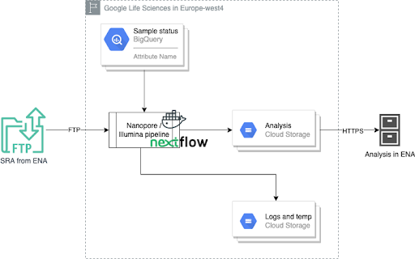

# covid-sequence-analysis-workflow

This is the official repository of the SARS-CoV-2 variant surveillance pipeline developed by Danish Technical University (DTU), Eotvos Lorand University (ELTE), EMBL-EBI, Erasmus Medical Center (EMC) under the [Versatile Emerging infectious disease Observatory (VEO)](https://www.globalsurveillance.eu/projects/veo-versatile-emerging-infectious-disease-observatory) project. The project consists of 20 European partners. It is funded by the European Commission.

The pipeline has been integrated on EMBL-EBI infrastructure to automatically process raw SARS-CoV-2 read data, presenting in the COVID-19 Data Portal: https://www.covid19dataportal.org/sequences?db=sra-analysis-covid19&size=15&crossReferencesOption=all#search-content.

## Architecture

The pipeline supports sequence reads from both Illumina and Nanopore platforms. It is designed to be highly portable for both Google Cloud Platform and High Performance Computing cluster with IBM Spectrum LSF. We have performed secondary and tertiary analysis on millions of public samples. The pipeline shows good performance for large scale production. 

The pipeline takes SRA from the public FTP from ENA. It submits analysis objects back to ENA on the fly. The intermediate results and logs are stored in the cloud storage buckets or high performance local POSIX file system. The metadata is stored in Google BigQuery for metadata and status tracking and analysis. The runtime is created with Docker / Singularity containers and NextFlow. 

## Process to run the pipelines

The pipeline requires the Nextflow Tower for the application level monitoring. A free test account can be created for evaluation purposes at https://tower.nf/.

### Preparation

1. Store `export TOWER_ACCESS_TOKEN='...'` in `$HOME/.bash_profile`. Restart the current session or source the updated `$HOME/.bash_profile`.
2. Run `git clone https://github.com/enasequence/covid-sequence-analysis-workflow`.
3. Create `./covid-sequence-analysis-workflow/data/projects_accounts.csv` with submission_account_id and submission_passwor, for example:
>  project_id,center_name,meta_key,submission_account_id,submission_password,ftp_password
>  PRJEB45555,"European Bioinformatics Institute",public,,,

### Running pipelines

1. Run `./covid-sequence-analysis-workflow/init.sra_index.sh` to initialize or reinitialize the metadata in BigQuery.
2. Run `./covid-sequence-analysis-workflow/./start.lsf.jobs.sh` with proper parameters to start the batch jobs on LSF or `./covid-sequence-analysis-workflow/./start.gls.jobs.sh` with proper parameters to start the batch jobs on GCP.

### Error handling

If a job is killed or died, run the following to update the metadata to avoid reprocessing samples completed successfully.

1. Run `./covid-sequence-analysis-workflow/update.receipt.sh <batch_id>` to collect the submission receipts and to update submission metadata. The script can be run at anytime. It needs to be run if a batch job is killed instead of completed for any reason.
2. Run `./covid-sequence-analysis-workflow/set.archived.sh` to update stats for analyses submitted. The script can be run at anytime. It needs to be run at least once before ending a snapshot to make sure that the stats are up-to-date.

To reprocess the samples failed, delete the record in `sra_processing`.
